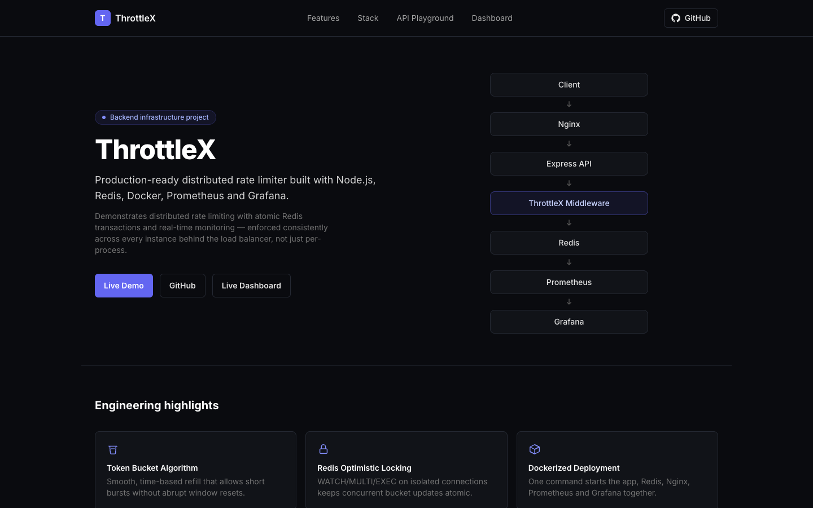
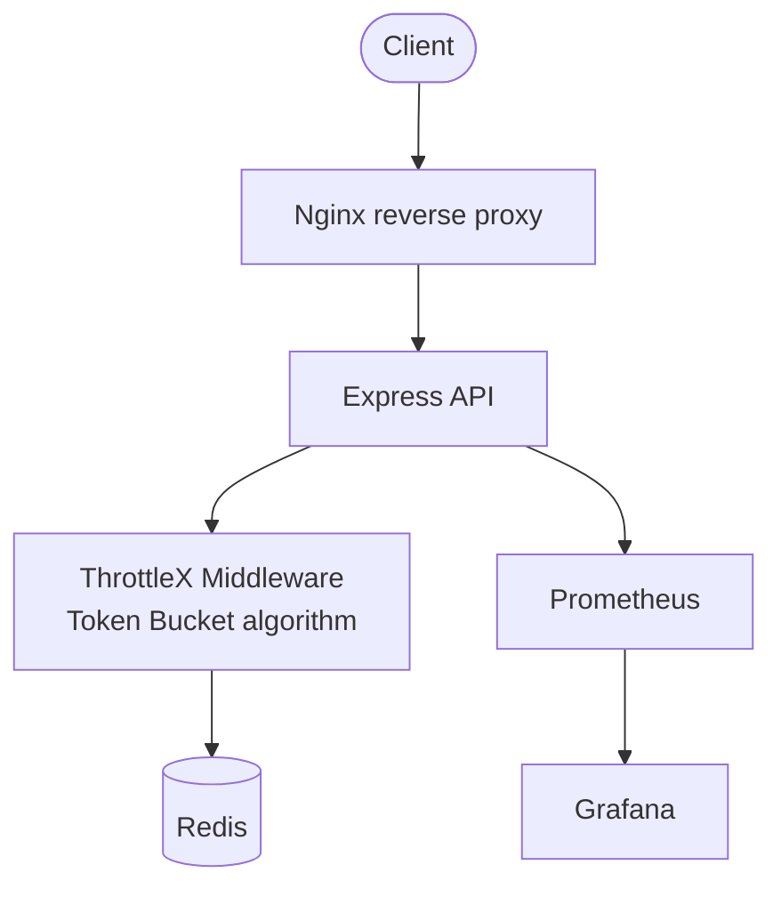
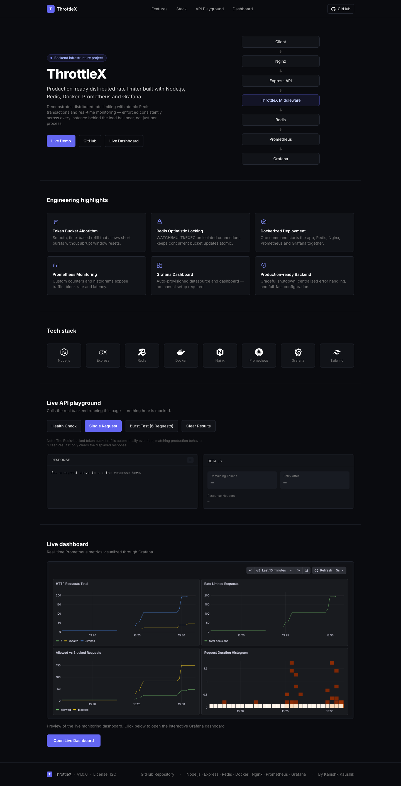
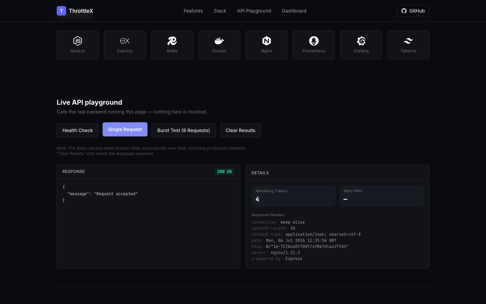
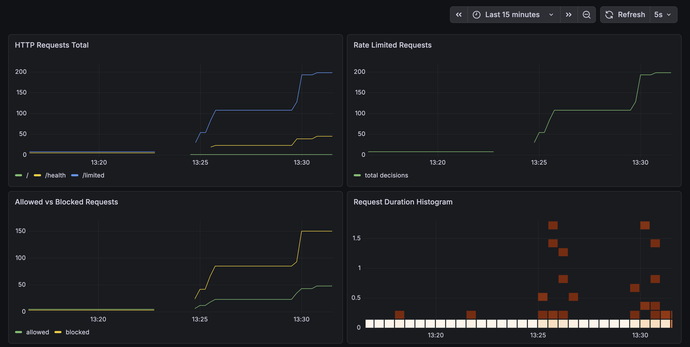

# ThrottleX

Production-ready distributed API rate limiter built with Node.js, Redis, Docker, Prometheus, and Grafana.



**Contents:** [Overview](#overview) · [Key Features](#key-features) · [Architecture](#architecture) · [Screenshots](#screenshots) · [Tech Stack](#tech-stack) · [Project Structure](#project-structure) · [Getting Started](#getting-started) · [Configuration](#configuration) · [API Endpoints](#api-endpoints) · [Monitoring](#monitoring) · [Known Limitations](#known-limitations) · [Future Improvements](#future-improvements) · [License](#license)

## Overview

A single API process can rate-limit clients in memory, but that guarantee breaks the moment more than one instance is running — each process ends up with its own counters, so a client can get *N* requests per instance instead of *N* total. ThrottleX solves this by storing rate-limit state in Redis, shared by every instance of the app, using a **Token Bucket** algorithm with optimistic locking (`WATCH`/`MULTI`/`EXEC`) so concurrent requests can never corrupt a bucket's state. Prometheus and Grafana are integrated end-to-end so the limiter's behavior — traffic volume, block rate, latency — is observable in real time instead of inferred from logs.

## Key Features

- Distributed Token Bucket rate-limiting algorithm
- Redis-backed shared state across every app instance
- Concurrency-safe optimistic locking (`WATCH`/`MULTI`/`EXEC` on isolated connections)
- Configurable limits via environment variables (capacity, refill rate, TTL)
- Dockerized architecture — app, Redis, Nginx, Prometheus, and Grafana with one command
- Nginx reverse proxy as the single public entry point
- Prometheus metrics (custom application metrics + default Node.js/process metrics)
- Auto-provisioned Grafana dashboard, no manual setup required
- Protected `/metrics` endpoint (blocked at the Nginx layer, unaffected for Prometheus itself)
- Health check endpoint reporting live Redis connectivity
- Graceful shutdown (`SIGINT`/`SIGTERM` → drain requests → close Redis connections)

## Architecture



Requests always enter through Nginx, which forwards everything to the Express app. The app reads and writes rate-limit state in Redis on every request to `/limited`. Prometheus independently scrapes the app's `/metrics` endpoint on a timer (it isn't part of the request path), and Grafana queries Prometheus to render dashboards.

## Screenshots

| Landing Page | API Playground |
|---|---|
|  |  |
| Dark-themed landing page with an architecture overview and feature highlights. | Interactive playground that calls the real backend — health checks, single requests, and burst tests against the live rate limiter. |

| Grafana Dashboard |
|---|
|  |
| Auto-provisioned dashboard showing request volume by endpoint, allowed vs. blocked traffic, latency, and resource usage. |

## Tech Stack

| Category | Technology |
|---|---|
| Backend | Node.js 22, Express 5 |
| Caching / Data Store | Redis 7 |
| Monitoring | Prometheus, Grafana OSS, `prom-client` |
| Infrastructure | Docker, Docker Compose, Nginx |
| Frontend | Tailwind CSS (CDN), vanilla JavaScript |

## Project Structure

```
ThrottleX/
├── src/
│   ├── config/       # Environment & rate-limiter configuration
│   ├── errors/       # Custom AppError class
│   ├── metrics/      # Prometheus metric definitions
│   ├── middleware/   # Rate limiter, metrics, error handling
│   ├── redis/        # Redis client & connection lifecycle
│   ├── routes/       # health, limited, metrics routes
│   ├── server/       # Express app wiring & process entrypoint
│   ├── services/     # Token Bucket algorithm
│   └── utils/        # Small shared helpers
├── public/           # Static landing page (served by Express)
├── docker/           # Nginx reverse-proxy config
├── prometheus/       # Prometheus scrape configuration
├── grafana/          # Auto-provisioned datasource & dashboard
├── docs/             # Documentation assets (screenshots)
├── Dockerfile
├── docker-compose.yml
└── README.md
```

## Getting Started

**1. Clone the repository**

```bash
git clone https://github.com/Codereaper-07/ThrottleX.git
cd ThrottleX
```

**2. Configure environment variables**

```bash
cp .env.example .env
```

Edit `.env` and set `GF_SECURITY_ADMIN_USER` / `GF_SECURITY_ADMIN_PASSWORD` — Docker Compose refuses to start Grafana without them (see [Configuration](#configuration)).

**3. Start the stack**

```bash
docker compose up --build
```

This starts the app, Redis, Nginx, Prometheus, and Grafana together.

**4. Access the application**

| Service | URL |
|---|---|
| Landing page / API playground | http://localhost:8080 |
| Health check | http://localhost:8080/health |
| Rate-limited demo endpoint | http://localhost:8080/limited |
| Prometheus | http://localhost:9090 |
| Grafana | http://localhost:3001 |

<details>
<summary><strong>Running locally without Docker</strong></summary>

Requires a Redis instance reachable from your machine.

```bash
npm install
cp .env.example .env   # adjust REDIS_HOST/REDIS_PORT if not running on localhost
npm run dev             # nodemon, auto-restarts on file changes
```

</details>

## Configuration

ThrottleX is configured entirely through environment variables, validated at startup so an invalid value fails fast instead of causing silent misbehavior.

| Variable | Default | Description |
|---|---|---|
| `PORT` | `3000` | HTTP port the Express server listens on |
| `REDIS_HOST` | `127.0.0.1` | Redis server hostname |
| `REDIS_PORT` | `6379` | Redis server port |
| `BUCKET_CAPACITY` | `5` | Max tokens (burst size) per rate-limit bucket |
| `REFILL_RATE` | `1` | Tokens refilled per second |
| `BUCKET_TTL` | `10` | Seconds an idle bucket key survives in Redis before expiring |
| `GF_SECURITY_ADMIN_USER` | *required* | Grafana admin username |
| `GF_SECURITY_ADMIN_PASSWORD` | *required* | Grafana admin password |

`BUCKET_CAPACITY`, `REFILL_RATE`, and `BUCKET_TTL` are independent — changing one does not automatically adjust the others.

## API Endpoints

| Method | Path | Description |
|---|---|---|
| `GET` | `/` | Landing page — static frontend with an embedded live API playground |
| `GET` | `/health` | Reports service status and live Redis connectivity |
| `GET` | `/limited` | Demo endpoint protected by the Token Bucket rate limiter — `200` when allowed, `429` with a `Retry-After` header when blocked |

`/metrics` is intentionally excluded — it's a Prometheus scrape target, not a public endpoint (see [Monitoring](#monitoring)).

## Monitoring

- **Prometheus** scrapes the app's `/metrics` endpoint every 5 seconds, collecting custom metrics (`http_requests_total`, `rate_limit_requests_total`, `http_request_duration_seconds`) alongside default Node.js/process metrics.
- **Grafana** auto-provisions a datasource and the **ThrottleX Overview** dashboard on startup — no manual setup required.
- **`/metrics` is protected**: it's blocked at the Nginx layer (`403` on port `8080`). Prometheus is unaffected, since it scrapes the app directly over the internal Docker network.
- **The Grafana dashboard is publicly viewable, read-only**: anonymous access is enabled and pinned to the `Viewer` role, so anyone can see live metrics without logging in, but can't edit or save anything. Editing still requires the admin credentials configured in `.env`.

## License

Licensed under the [ISC License](https://opensource.org/license/isc-license-txt), as declared in `package.json`.
